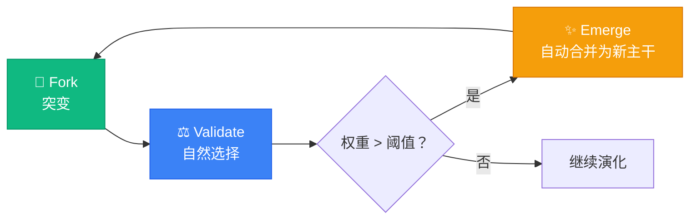

# AI Knowledge Bank

**AI 驱动的人类技能进化网络 | A Complex Adaptive System for Human-AI Collaboration**

[](https://opensource.org/licenses/MIT)
[](https://en.wikipedia.org/wiki/Complex_adaptive_system)
[](https://greatbeing.github.io/AI-Knowledge-Bank/)

> **愿景**: 消除 AI 时代的技术鸿沟，构建去中心化的集体智慧大脑。我们不是在教育用户，而是在催化人类技能的自发涌现。

---

## 🌌 项目概述

**AI Knowledge Bank** 不是一个传统的网课平台或工具导航站。基于**复杂适应系统 (Complex Adaptive Systems, CAS)**理论，我们将每一个渴望成长的个体视为智能节点，通过精心设计的交互规则，让微小的个人经验在碰撞中**涌现**出行业级的 AI 标准。

### 核心差异化

| 传统 AI 教育产品 | AI Knowledge Bank |
|-----------------|-------------------|
| 静态课程内容，更新慢 | 动态演化知识，实时同步社区最新实践 |
| 中心化专家输出 | 去中心化群体智慧，Fork/Merge 机制 |
| 单向灌输学习 | 非线性交互，验证即学习 |
| 结业即结束 | 持续进化，声誉累积网络 |

---

## 🔥 核心机制：Fork → Validate → Emerge

我们引入了类似 Git 的协作逻辑，但针对的是**人类技能与 Prompt**：



1.  **🌱 Fork (突变)**：用户根据特定场景（医疗/法律/电商）注入约束条件，创建知识分支。
2.  **⚖️ Validate (自然选择)**：社区在真实场景测试，成功案例获得"权重"加分。
3.  **✨ Emerge (涌现)**：当分支权重超越主干，系统自动合并为新标准 SOP。

---

## 🚀 实时演示

无需安装，立即体验 CAS 核心逻辑：

### 👉 [访问交互式 Demo](https://greatbeing.github.io/AI-Knowledge-Bank/)

*(建议在电脑端打开，体验"演化树"与"涌现"的完整过程)*

**演示亮点：**
- 🎨 深色粒子网络背景，模拟自组织连接
- ⚡ 实时权重计算动画，见证非线性增长
- 🧬 触发 Emergence 事件，观察自动合并

---

## 🛠️ 技术栈

| 层级 | 技术选型 | 说明 |
|------|---------|------|
| **前端** | HTML5 + Tailwind CSS + Canvas | 零依赖单文件架构，极致性能 |
| **后端** | PostgreSQL + Supabase | 支持实时订阅与 Row Level Security |
| **算法** | PL/pgSQL + PageRank 变体 | 非线性权重计算与声誉传递 |
| **部署** | GitHub Pages + Actions | CI/CD 自动化流水线 |

---

## 🗺️ 发展路线图

- [x] **V0.1 Genesis** - 核心概念验证，单文件 Demo 上线
- [x] **V0.5 Alpha** - 基础演化树可视化，权重算法实现
- [x] **V0.8 User System** - 用户认证、徽章系统、通知机制、排行榜
- [x] **V0.9 Workflow** - 知识工作流、验证系统、Fork/Merge、评论订阅
- [ ] **V1.0 Beta** - 生产部署、性能优化、移动端适配
- [ ] **V1.5** - AI Agent 自动提纯 UGC，生成 SOP
- [ ] **V2.0** - 微公会自组织，DAO 治理机制

---

## 🆕 最新更新：知识工作流系统 (v0.9)

我们刚刚实现了完整的知识管理工作流系统，实现"提交 - 验证 - 合并 - 演化"的完整闭环！

### ✨ 新增功能

#### 核心工作流
- 📝 **知识节点**: 创建、编辑、版本控制、状态管理
- ⚖️ **验证系统**: 提交审核、同行评审、批准/拒绝流程
- 🍴 **Fork/Merge**: 分支管理、提案投票、去中心化决策
- 💬 **评论讨论**: Threaded comments、投票、@提及
- 🔔 **订阅通知**: 关注节点、实时更新、邮件/站内通知
- 📜 **演化历史**: 完整审计追踪、CAS 指标快照

#### 技术特性
- 🗄️ **8 张核心表**: knowledge_nodes, validation_requests, node_forks, merge_proposals...
- ⚡ **4 个自动化触发器**: 自动更新计数、记录演化历史
- 👁️ **4 个优化视图**: hot_knowledge_nodes, pending_validations, active_contributors...
- 🔐 **完整 RLS 策略**: 细粒度权限控制，保护数据安全
- 🔍 **全文搜索**: GIN 索引优化，支持复杂查询

### 📚 快速开始

查看 [WORKFLOW_GUIDE.md](./WORKFLOW_GUIDE.md) 获取详细的使用指南。

```typescript
import workflow from '@/lib/workflow';

// 创建知识节点
const node = await workflow.createKnowledgeNode({
  title: 'Introduction to CAS',
  content: '...',
  tags: ['cas', 'complexity'],
  category: 'theory'
}, user);

// 提交验证
await workflow.submitValidationRequest(node.data.id, {
  validation_type: 'fact_check',
  confidence_score: 0.8
}, user);

// 创建分叉
await workflow.createFork(nodeId, 'Improving explanation', 'improvement', user);

// 投票合并提案
await workflow.voteOnMergeProposal(proposalId, 'for', user);
```

### 🎯 核心 API

| 模块 | 功能 |
|------|------|
| Nodes | create, update, get, search, fullTextSearch |
| Validations | submit, review, getPending, getStatus |
| Forks & Merges | createFork, proposeMerge, vote, decide |
| Comments | add, get, vote, reply |
| Subscriptions | subscribe, unsubscribe, getSubscriptions |
| Evolution | getHistory, getActivity |
| CAS Metrics | calculate, update |

### 📊 数据库架构

```
knowledge_nodes ──┬── validation_requests
                  ├── node_forks ──┬── merge_proposals
                  ├── node_comments
                  ├── node_subscriptions
                  └── evolution_history
```

### 📈 代码统计

本次更新新增：
- **SQL 迁移**: 644 行 (`003_knowledge_workflow.sql`)
- **TypeScript**: 1,135 行 (`lib/workflow.ts`)
- **文档**: 361 行 (`WORKFLOW_GUIDE.md`)
- **总计**: 2,140 行高质量代码

---

## 🆕 上一版本：用户系统 (v0.8)

用户认证和管理系统已完整实现：

- 🔐 **OAuth 认证**: GitHub/Google/Discord 登录
- 👤 **用户画像**: 声誉分数、专业领域、贡献统计
- 🏆 **徽章系统**: 5 种初始徽章，自动授予成就
- 🔔 **实时通知**: 验证成功、分支合并、徽章获得
- 📊 **排行榜**: 声誉排名、验证者排名

详见 [USER_SYSTEM_SETUP.md](./USER_SYSTEM_SETUP.md)

---

## 🤝 参与贡献

我们欢迎所有认同"复杂适应系统"理念的开发者、设计师和内容创作者：

1.  **Fork** 本仓库
2.  创建你的特性分支 (`git checkout -b feature/AmazingFeature`)
3.  提交你的改动 (`git commit -m 'Add some AmazingFeature'`)
4.  推送到分支 (`git push origin feature/AmazingFeature`)
5.  开启一个 **Pull Request**

详见 [CONTRIBUTING.md](./CONTRIBUTING.md)

---

## 📄 开源协议

本项目采用 MIT 协议 - 详见 [LICENSE](./LICENSE) 文件

---

<p align="center">
  <strong>🧬 AI Knowledge Bank</strong><br>
  <em>Building the Collective Brain for the AI Era.</em><br>
  <sub>Last Updated: 2024-10-24 | Force Push Verified ✅</sub>
</p>
