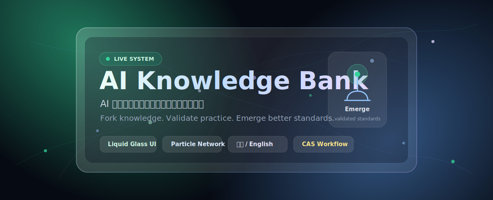
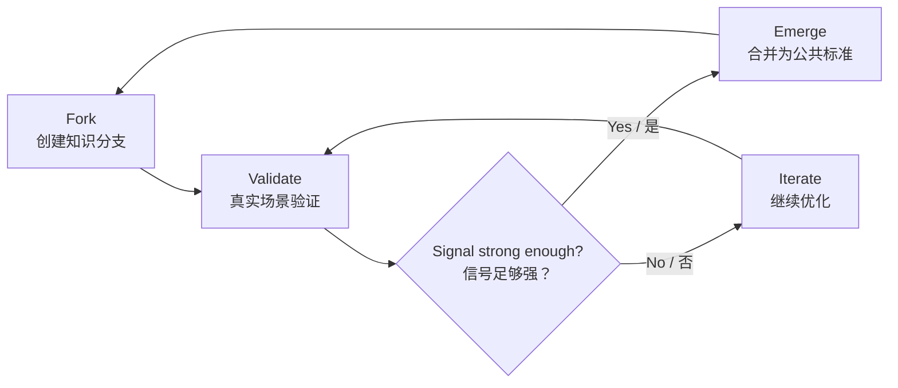

# AI Knowledge Bank

<p align="center">
  
</p>

<p align="center">
  <a href="https://aiknowledgebank.pages.dev"><strong>Cloudflare Live</strong></a>
  ·
  <a href="https://ai-knowledge-bank.pages.dev">Backup Site</a>
  ·
  <a href="https://greatbeing.github.io/AI-Knowledge-Bank/">GitHub Pages</a>
  ·
  <a href="./WORKFLOW_GUIDE.md">Workflow Guide</a>
  ·
  <a href="./CONTRIBUTING.md">Contributing</a>
</p>

<p align="center">
  
  
  
  
  
</p>

<p align="center">
  <strong>AI-driven knowledge evolution network for human-AI collaboration</strong><br />
  <span>面向 AI 时代的人类知识协作、验证与涌现网络</span>
</p>

---

## Project Vision / 项目愿景

**EN** · AI Knowledge Bank is a three-vault knowledge evolution system. It helps people turn scattered AI practices into reusable standards through personalized AI dispatch, branching, validation, discussion, voting, and emergence.

**中文** · AI Knowledge Bank 不是静态课程站，也不是普通 Prompt 仓库。它以知识库、工具库、案例库为骨架，把知识看作一个持续演化的网络：用户贡献实践经验，AI 跨库调度，社区在真实场景中验证，高价值分支再合并为新的公共标准。

## Three Vaults + Two Engines / 三库两引擎

| System part | English | 中文 |
| --- | --- | --- |
| Knowledge Vault | Principles, cognitive models, explainers, and decision frames | 原理、认知模型、解释器和判断框架 |
| Tools Vault | Agents, prompts, workflows, automation routes, and sandbox recipes | Agent、Prompt、工作流、自动化路径和沙盒配方 |
| Cases Vault | Before/After records, SOP reviews, validation evidence, and version trees | Before/After、SOP 复盘、验证证据和版本树 |
| Cross-Vault RAG | Personalized retrieval across all vaults, returning cognition + route + evidence | 跨三库个性化调度，输出认知解释、工具路径和案例证据 |
| Community Evolution | Real-world signals from validation, usage, forks, merges, decay, and disputes | 由验证、使用、分叉、合并、衰减和争议组成的社区演化机制 |

## Experience Design / 体验设计

| Design layer | English | 中文 |
| --- | --- | --- |
| Network atmosphere | Dynamic particle grid inspired by connected knowledge nodes | 以动态粒子网格表达知识节点之间的连接 |
| Liquid glass | Translucent navigation, metric panels, cards, and actions | 导航、数据面板和操作按钮采用液态玻璃质感 |
| Bilingual interface | Runtime Chinese and English language switching | 支持中英文运行时切换 |
| Dispatch console | Cross-vault scenario demo with routed knowledge, tool, and case results | 跨三库场景调度演示，返回知识、工具和案例结果 |
| Knowledge workflow | Fork, validate, discuss, vote, merge, and track evolution | 分叉、验证、讨论、投票、合并、追踪演化 |
| Deployment surface | Cloudflare Pages, GitHub Pages, and Vercel-compatible build | 支持 Cloudflare Pages、GitHub Pages 和 Vercel 构建 |

## Core Loop / 核心闭环



The system borrows collaboration ideas from Git, but applies them to human skills, AI workflows, and reusable knowledge assets.

这个系统借鉴 Git 的协作思想，但对象不是代码，而是人类技能、AI 工作流和可复用知识资产。

## Feature Matrix / 功能矩阵

| Module | English | 中文 |
| --- | --- | --- |
| Three vault model | `vault_type` separates knowledge, tools, and cases | 用 `vault_type` 区分知识库、工具库和案例库 |
| Cross-Vault RAG contract | Query once and receive knowledge, tool, and case result groups | 一次查询返回知识、工具和案例三组结果 |
| Community signals | Validation, usage, forks, merges, and disputes can feed evolution scoring | 验证、使用、分叉、合并、争议可进入演化评分 |
| Knowledge nodes | Create, update, search, version, and categorize knowledge | 创建、更新、搜索、版本化和分类知识节点 |
| Validation | Submit fact checks, peer reviews, and scenario validation | 提交事实核验、同行评审和场景验证 |
| Fork and merge | Create branches, propose merges, vote, and decide | 创建分支、发起合并提案、投票和决策 |
| Discussion | Threaded comments, replies, and community feedback | 多级评论、回复和社区反馈 |
| Subscription | Follow nodes and receive update notifications | 关注节点并接收更新通知 |
| Evolution history | Track how knowledge changes over time | 追踪知识随时间变化的完整历史 |
| CAS metrics | Calculate activity, reputation, and emergence indicators | 计算活跃度、声誉和涌现指标 |

## Live Preview / 在线预览

| Platform | URL |
| --- | --- |
| Primary Cloudflare Pages | <https://aiknowledgebank.pages.dev> |
| Cloudflare Pages backup | <https://ai-knowledge-bank.pages.dev> |
| GitHub Pages | <https://greatbeing.github.io/AI-Knowledge-Bank/> |

## Tech Stack / 技术栈

| Layer | Technology |
| --- | --- |
| Frontend | Vite 6, TypeScript, HTML5, Canvas |
| UI system | Tailwind CSS, liquid glass visual language |
| Data layer | Supabase, PostgreSQL, Row Level Security |
| Workflow logic | TypeScript service, SQL triggers, optimized views |
| Deployment | Cloudflare Pages, GitHub Pages, Vercel |
| Quality | ESLint 9 flat config, TypeScript build checks |

## Quick Start / 快速开始

```bash
npm install
npm run dev
```

Build and verify / 构建与验证：

```bash
npm run lint
npm run build
npm run preview
```

## Supabase Setup / Supabase 配置

The project can run as a static demo without Supabase credentials. To enable the full workflow backend, create a Supabase project and run the migrations in order:

本项目可以在没有 Supabase 配置的情况下作为静态演示运行。如果要启用完整知识工作流后端，请创建 Supabase 项目并按顺序执行迁移：

```text
supabase/migrations/001_cas_emergence_algorithm.sql
supabase/migrations/002_user_system.sql
supabase/migrations/003_knowledge_workflow.sql
supabase/migrations/004_three_vault_cross_rag.sql
```

Then configure / 然后配置：

```env
VITE_SUPABASE_URL=your-project-url
VITE_SUPABASE_ANON_KEY=your-anon-key
```

Related docs / 相关文档：

| Guide | Purpose |
| --- | --- |
| [USER_SYSTEM_SETUP.md](./USER_SYSTEM_SETUP.md) | User auth, profile, badges, notifications |
| [WORKFLOW_GUIDE.md](./WORKFLOW_GUIDE.md) | Knowledge workflow API and usage |
| [DEPLOYMENT_GUIDE.md](./DEPLOYMENT_GUIDE.md) | Deployment options and environment setup |

## Project Structure / 项目结构

```text
.
├── index.html                 # Main experience and particle network UI
├── assets/readme/             # Repository homepage visual assets
├── components/                # React components and visual modules
├── lib/                       # Auth, workflow, and shared utilities
├── supabase/migrations/       # Database schema, policies, triggers, views
├── types/                     # TypeScript definitions
├── .github/workflows/         # GitHub Pages deployment workflow
└── dist/                      # Production build output
```

## Roadmap / 路线图

| Stage | Status | Focus |
| --- | --- | --- |
| V0.1 Genesis | Done | Concept validation and first interactive demo |
| V0.5 Alpha | Done | Evolution tree and scoring model |
| V0.8 User System | Done | Authentication, profiles, badges, notifications |
| V0.9 Workflow | Done | Knowledge nodes, validation, fork, merge, comments |
| V1.0 Beta | In progress | Three-vault UX, Cross-Vault RAG contract, community evolution signals |
| V1.5 Agent Layer | Planned | AI-assisted knowledge extraction and SOP generation |
| V2.0 Governance | Planned | Community governance and decentralized contribution rules |

## Contributing / 参与贡献

Contributions are welcome from developers, designers, AI practitioners, educators, and researchers interested in better human-AI collaboration systems.

欢迎开发者、设计师、AI 实践者、教育者和研究者参与，共同探索更好的 Human-AI 协作系统。

1. Fork the repository.
2. Create a feature branch.
3. Commit focused changes.
4. Open a pull request with a clear explanation.

See [CONTRIBUTING.md](./CONTRIBUTING.md) for contribution details.

## License / 开源协议

This project is released under the [MIT License](./LICENSE).

---

<p align="center">
  <strong>AI Knowledge Bank</strong><br />
  <span>Build, validate, and evolve knowledge for the AI era.</span><br />
  <span>为 AI 时代构建、验证并演化知识。</span>
</p>
