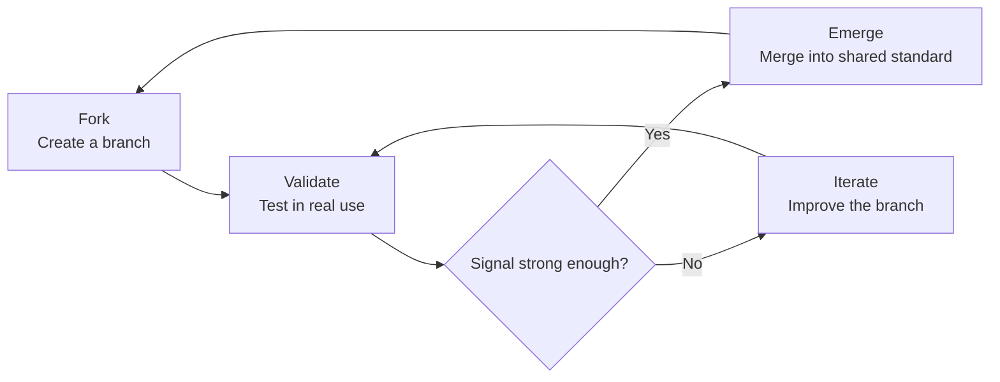

# AI Knowledge Bank

<p align="center">
  <strong>AI-driven knowledge evolution network for human-AI collaboration</strong><br />
  <span>一个面向 AI 时代的知识协作、验证与涌现系统</span>
</p>

<p align="center">
  <a href="https://aiknowledgebank.pages.dev">Live Site</a>
  ·
  <a href="https://ai-knowledge-bank.pages.dev">Cloudflare Pages</a>
  ·
  <a href="https://greatbeing.github.io/AI-Knowledge-Bank/?v=20260609-2">GitHub Pages</a>
  ·
  <a href="./WORKFLOW_GUIDE.md">Workflow Guide</a>
</p>

<p align="center">
  
  
  
  
  
</p>

---

## Overview

AI Knowledge Bank is not a static course library or a simple prompt collection. It treats knowledge as an evolving network: people submit useful AI practices, the community validates them in real scenarios, and high-signal branches can merge back into shared standards.

AI Knowledge Bank 不是传统课程站，也不是静态 Prompt 仓库。它把知识看作一个会持续演化的网络：用户提交实践经验，社区在真实场景中验证，高价值分支再合并为新的公共标准。

## Product Experience

The current homepage focuses on a lightweight, futuristic knowledge-bank interface:

| Area | What it does |
| --- | --- |
| Dynamic network hero | Canvas particle grid that visualizes connected knowledge nodes |
| Liquid glass UI | Translucent navigation, cards, buttons, and metric panels |
| Language switch | Runtime Chinese and English content switching |
| Knowledge workflow | Fork, validate, discuss, vote, merge, and track evolution |
| Deployment ready | GitHub Pages, Cloudflare Pages, and Vercel-compatible Vite build |

## Core Model



The system borrows collaboration ideas from Git, but applies them to human skills, AI workflows, and reusable knowledge assets.

## Feature Map

| Module | Capabilities |
| --- | --- |
| Knowledge nodes | Create, update, search, version, and categorize reusable knowledge |
| Validation requests | Submit fact checks, peer reviews, and scenario-based validation |
| Fork and merge | Create branches, propose merges, vote, and resolve decisions |
| Comments | Threaded discussions, replies, and community feedback |
| Subscriptions | Follow nodes and receive update notifications |
| Evolution history | Track how knowledge changes over time |
| CAS metrics | Calculate complexity-inspired activity and emergence indicators |

## Tech Stack

| Layer | Technology |
| --- | --- |
| Frontend | Vite 6, TypeScript, HTML5, Canvas |
| UI | Tailwind CSS, liquid glass visual system |
| Data layer | Supabase, PostgreSQL, Row Level Security |
| Logic | TypeScript workflow service, SQL triggers and views |
| Deployment | Cloudflare Pages, GitHub Pages, Vercel |
| Quality | ESLint 9 flat config, TypeScript build checks |

## Live URLs

| Platform | URL |
| --- | --- |
| Primary Cloudflare Pages | <https://aiknowledgebank.pages.dev> |
| Cloudflare Pages backup | <https://ai-knowledge-bank.pages.dev> |
| GitHub Pages | <https://greatbeing.github.io/AI-Knowledge-Bank/?v=20260609-2> |

## Quick Start

```bash
npm install
npm run dev
```

Build and verify:

```bash
npm run lint
npm run build
npm run preview
```

## Supabase Setup

The project can run as a static demo without Supabase credentials. To enable the full workflow backend, create a Supabase project and run the migrations in order:

```text
supabase/migrations/001_cas_emergence_algorithm.sql
supabase/migrations/002_user_system.sql
supabase/migrations/003_knowledge_workflow.sql
```

Then configure:

```env
VITE_SUPABASE_URL=your-project-url
VITE_SUPABASE_ANON_KEY=your-anon-key
```

See [USER_SYSTEM_SETUP.md](./USER_SYSTEM_SETUP.md), [WORKFLOW_GUIDE.md](./WORKFLOW_GUIDE.md), and [DEPLOYMENT_GUIDE.md](./DEPLOYMENT_GUIDE.md) for deeper setup notes.

## Project Structure

```text
.
├── index.html                 # Main experience and particle network UI
├── components/                # React components and visual modules
├── lib/                       # Auth, workflow, and shared utilities
├── supabase/migrations/       # Database schema, policies, triggers, views
├── types/                     # TypeScript definitions
├── .github/workflows/         # GitHub Pages deployment workflow
└── dist/                      # Production build output
```

## Roadmap

| Stage | Status | Focus |
| --- | --- | --- |
| V0.1 Genesis | Done | Concept validation and first interactive demo |
| V0.5 Alpha | Done | Evolution tree and scoring model |
| V0.8 User System | Done | Authentication, profiles, badges, notifications |
| V0.9 Workflow | Done | Knowledge nodes, validation, fork, merge, comments |
| V1.0 Beta | In progress | Production deployment, mobile polish, performance |
| V1.5 Agent Layer | Planned | AI-assisted knowledge extraction and SOP generation |
| V2.0 Governance | Planned | Community governance and decentralized contribution rules |

## Contributing

Contributions are welcome from developers, designers, AI practitioners, educators, and researchers interested in better human-AI collaboration systems.

1. Fork the repository.
2. Create a feature branch.
3. Commit focused changes.
4. Open a pull request with a clear explanation.

See [CONTRIBUTING.md](./CONTRIBUTING.md) for contribution details.

## License

This project is released under the [MIT License](./LICENSE).

---

<p align="center">
  <strong>AI Knowledge Bank</strong><br />
  <span>Build, validate, and evolve knowledge for the AI era.</span>
</p>
