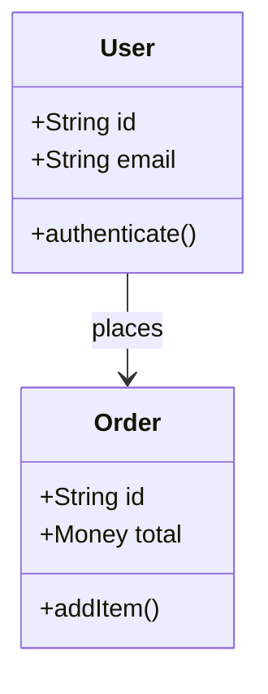

# AI Knowledge Bank - 创世节点 (Genesis Nodes)

> **重要说明**: 这 3 个创世节点将奠定整个社区的基调 (Tone)。它们不是简单的"如何用 AI 写邮件"，而是极具商业价值、结构严密的行业级 SOP。每一个节点都融合了**知识层**、**工具层**和**案例层**，展现系统的专业深度。

---

## 🌍 创世节点 1: 【跨境出海】多语言本地化营销物料生成流

### 痛点分析
直接用大模型翻译的西班牙语/阿拉伯语文案，往往语法正确但"毫无网感"，甚至触犯文化禁忌。跨境卖家需要的是**文化对齐**而非简单翻译。

### 三库融合设计

| 层级 | 内容 |
|------|------|
| **知识层** | 霍夫斯泰德文化维度理论在 Prompt 中的应用 |
| **工具层** | 本地俚语知识库 (RAG) + 防幻觉约束指令 |
| **案例层** | Instagram Reels 短视频脚本生成 SOP |

### 核心 Prompt 骨架 (SOP)

```text
[Role] 
你是拥有 10 年经验的拉美区资深本土化营销专家，精通墨西哥本土 slang 和消费者心理学。

[Context] 
我们将推出一款客单价 $50 的便携式咖啡机。
目标受众是 25-35 岁的墨西哥城职场白领。

[Constraint - 文化对齐] 
墨西哥文化在"不确定性规避"(Uncertainty Avoidance) 上得分较高 (82 分)。
→ 文案必须强调"耐用性、售后保障、确定性"
→ 避免使用过于激进或冒险的词汇 (如"革命性"、"颠覆")
→ 使用家庭、温暖、可信赖的情感锚点

[Task] 
将以下英文卖点转化为 3 条 Instagram Reels 的短视频脚本：
- 30 秒快速加热
-  compact 便携设计
- 一键清洗功能

[Output Format]
每条脚本包含：
1. Hook(前 3 秒抓人台词)
2. 场景描述 (视觉画面)
3. 口播文案 (西班牙语，带本土 slang)
4. CTA(行动号召)

[Anti-Hallucination] 
严禁捏造产品不存在的功能 (如自动研磨)。
若遇到无法确定的本土化表达，请用 [需人工校验] 标出。
```

### 预期涌现路径
1. **V1.0 主干**: 基础的多语言翻译框架
2. **V1.1 拉美分支**: @Carlos_Dev 注入墨西哥电商俚语库
3. **V1.2 中东分支**: @Fatima_UAE 添加阿拉伯语右向左排版约束
4. **V2.0 涌现合并**: 系统检测到 V1.1 权重超越主干，自动合并为新的多语言营销标准 SOP

---

## 💻 创世节点 2: 【独立开发者】PRD 到全栈代码骨架自动化 Agent

### 痛点分析
从想法到代码的"冷启动"阶段最耗费心智。开发者容易遗漏边缘场景，且重复编写 boilerplate 代码浪费创造力。

### 三库融合设计

| 层级 | 内容 |
|------|------|
| **知识层** | 领域驱动设计 (DDD) 在 AI 提示词中的映射 |
| **工具层** | Cursor / GitHub Copilot Workspace 的 System Prompt 模板 |
| **案例层** | 从 PRD.md 到 OpenAPI 契约的完整工作流 |

### 核心 Prompt 骨架 (SOP)

```text
[Action] 
读取附带的 PRD.md 文件，执行以下三步工作流。

───────────────────────────────────────
Step 1: 领域建模 (Domain Modeling)
───────────────────────────────────────
提取核心实体 (Entities) 和值对象 (Value Objects)。
识别聚合根 (Aggregate Roots) 和边界上下文 (Bounded Contexts)。

输出：Mermaid 类图代码


───────────────────────────────────────
Step 2: 接口契约 (API Contract)
───────────────────────────────────────
基于 RESTful 规范，生成 OpenAPI 3.0 (Swagger) YAML 文件。

要求:
- 必须包含所有错误码 (400/401/403/404/500) 的 Schema
- 每个 Endpoint 必须有请求/响应示例
- 标注认证方式 (JWT/OAuth2)

输出：openapi.yaml 完整内容

───────────────────────────────────────
Step 3: 边缘用例 (Edge Cases)
───────────────────────────────────────
作为 QA 专家，列出该 PRD 中未提及的 5 个极端边缘场景。

示例:
- 并发下单时的库存超卖问题
- 用户在中途断开网络的事务回滚
- 时区转换导致的日期计算错误

输出：补充到测试用例列表中，格式为 Jest/GitHub Actions 兼容的测试描述。
```

### 预期涌现路径
1. **V1.0 主干**: 基础的 PRD 解析框架
2. **V1.1 前端分支**: @ReactDev 注入 Next.js App Router 最佳实践
3. **V1.2 测试分支**: @QA_Master 添加 Playwright E2E 测试生成
4. **V2.0 涌现合并**: 形成全栈开发的标准 AI 工作流

---

## 📊 创世节点 3: 【金融分析】长文本财报 (10-K) 风险因子自动抽取与对比矩阵

### 痛点分析
几百页的 PDF 财报，人工提取"风险因素 (Risk Factors)"并与去年对比，极其耗时且易漏。分析师需要快速识别语气变化和潜在做空切入点。

### 三库融合设计

| 层级 | 内容 |
|------|------|
| **知识层** | 长上下文模型的"迷失在中间"(Lost in the Middle) 现象及规避策略 |
| **工具层** | LlamaIndex 文档分块 + 层级摘要 (Hierarchical Summarization) |
| **案例层** | 华尔街做空机构风格的风险对比矩阵 |

### 核心 Prompt 骨架 (SOP)

```text
[System] 
你是一个严苛的华尔街做空机构分析师，擅长从财报字里行间发现危险信号。

[Input] 
附件为公司 2023 年与 2024 年的 10-K 财报 PDF。

[Task] 
执行"风险因子差异分析"(Risk Factor Delta Analysis)。

[Strategy - 对抗 Lost in the Middle] 
1. 先将每份财报按章节分块 (Chunking)
2. 对每个 Risk Factor 章节单独做摘要
3. 最后将所有摘要合并进行对比分析
4. 禁止直接丢入整个 PDF 让模型"自己找"

[Output Format] 
输出一个 Markdown 表格，包含以下列：

| 风险类别 | 2023 年描述摘要 | 2024 年描述摘要 | 语气变化分析 | 潜在做空切入点 | 引用锚点 |
|----------|----------------|----------------|-------------|---------------|---------|
| 供应链风险 | "可能存在原材料波动" | "正在经历严重的供应链中断" | 从"可能"变为"正在"，风险升级 | 毛利率可能在下季度承压 | [2024 10-K, Page 45, Paragraph 2] |
| 法律诉讼 | 无特别提及 | "收到 SEC 调查通知" | 新增重大风险项 | 潜在的罚款和声誉损失 | [2024 10-K, Page 78, Item 3] |

[Rule - 引用锚点] 
必须使用"引用锚点"(如 [Page 45, Paragraph 2]) 来支撑你的每一个提取结论。
杜绝任何模型幻觉。若无法定位原文，标注 [无法验证]。

[Tone] 
保持怀疑主义态度。对于模糊表述 (如"可能"、"估计")，标注为 [低置信度]。
```

### 预期涌现路径
1. **V1.0 主干**: 基础的长文本摘要框架
2. **V1.1 法律分支**: @LawyerAI 添加 SEC 法规合规性检查
3. **V1.2 量化分支**: @QuantDev 集成 Python 代码自动计算风险指标变化率
4. **V2.0 涌现合并**: 形成机构级财报分析的标准 AI 工作流

---

## 🎯 如何使用这些创世节点

### 冷启动阶段 (Day 1-7)
1. **手动录入数据库**: 将这 3 个节点插入 `nodes` 表，设置初始权重 (85-112)
2. **种子用户任务**: 邀请 5 位行业专家 (跨境卖家、独立开发者、金融分析师) 体验并 Fork
3. **模拟涌现**: 运营团队手动创建 2-3 个高质量分支，展示系统的演化能力

### 增长阶段 (Week 2-4)
1. **社区挑战**: 发起"改进创世节点"竞赛，奖励最佳 Fork
2. **AI 提纯**: 当某个分支获得 10+ 次验证，触发 AI 自动生成合并报告
3. **内容外溢**: 将涌现出的 V2.0 SOP 发布到 Twitter/LinkedIn，吸引外部流量

### 生态阶段 (Month 2+)
1. **用户生成创世节点**: 开放提名机制，社区投票决定下一个"创世节点"主题
2. **行业垂直化**: 基于这 3 个节点的成功模式，复制到医疗、教育、制造等行业
3. **企业 API**: 允许企业调用经过百万次验证的 SOP，形成 B2B 收入流

---

## 📈 成功指标

| 指标 | 目标值 (30 天) | 测量方式 |
|------|---------------|----------|
| 创世节点 Fork 数 | ≥ 20 | 数据库 `interactions` 表统计 |
| 涌现事件触发 | ≥ 3 | `is_emerging = true` 的节点数 |
| 用户留存率 | ≥ 60% | 7 日后仍活跃的用户比例 |
| 社区 UGC 质量 | ≥ 8/10 | 随机抽样 20 个节点的人工评分 |

---

**这 3 个创世节点是 AI Knowledge Bank 的"初代基因"**。它们的品质将直接决定整个生态的进化方向。让我们用国际水准的内容，开启这场人类技能进化的实验！
