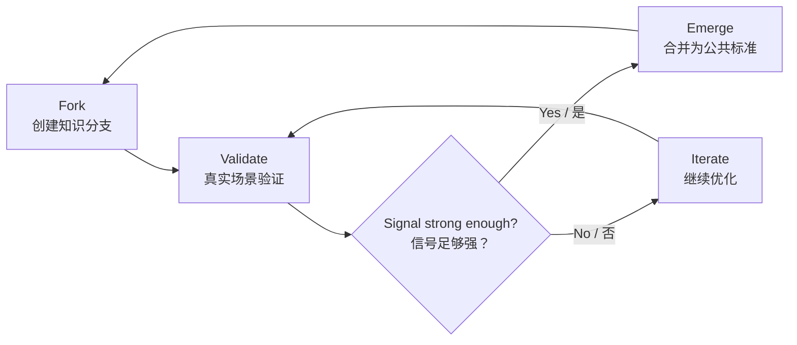

# Phase 1 Quality Foundation Implementation Plan

> **For agentic workers:** REQUIRED SUB-SKILL: Use superpowers:subagent-driven-development (recommended) or superpowers:executing-plans to implement this plan task-by-task. Steps use checkbox (`- [ ]`) syntax for tracking.

**Goal:** Restore baseline product quality by repairing corrupted Chinese/public documentation text and proving the project still lints and builds.

**Architecture:** This phase is a focused copy and validation pass. It preserves the existing static pages, Cloudflare Pages Function API contract, Supabase schema, and deployment targets while replacing mojibake text with readable UTF-8 content.

**Tech Stack:** Vite 6, TypeScript 5, Tailwind CSS, Cloudflare Pages Functions, Supabase, ESLint 9.

---

## File Structure

- Modify `README.md`: replace corrupted Chinese sections and broken Mermaid/tree glyphs with readable bilingual product documentation.
- Modify `assets/vault-page.js`: repair Chinese runtime dictionary, Chinese insights, community signal labels, and English language toggle text.
- Modify `functions/api/[[path]].js`: repair fallback node text, fallback Chinese synthesis, generated recommendation reasons, fallback summaries, and fallback titles without changing JSON response shape.
- Modify `CONTRIBUTING.md`: repair command formatting, conventional commit examples, and file tree glyph corruption.
- Modify `CHANGELOG.md`: replace corrupted arrow/date separators with plain ASCII hyphens.
- Verify with `npm run lint` and `npm run build`.

---

### Task 1: Repair README Public Copy

**Files:**
- Modify: `README.md`

- [ ] **Step 1: Replace `README.md` with clean bilingual copy**

Use the existing structure and links, but replace corrupted Chinese text and broken diagram/tree glyphs. Keep the same public URLs, stack table, setup commands, API endpoint table, roadmap, and license reference.

Suggested content structure:

```markdown
# AI Knowledge Bank

<p align="center">
  
</p>

<p align="center">
  <a href="https://aiknowledgebank.pages.dev"><strong>Cloudflare Live</strong></a>
  |
  <a href="https://ai-knowledge-bank.pages.dev">Backup Site</a>
  |
  <a href="https://greatbeing.github.io/AI-Knowledge-Bank/">GitHub Pages</a>
  |
  <a href="./WORKFLOW_GUIDE.md">Workflow Guide</a>
  |
  <a href="./CONTRIBUTING.md">Contributing</a>
</p>

<p align="center">
  
  
  
  
  
</p>

<p align="center">
  <strong>AI-driven knowledge evolution network for human-AI collaboration</strong><br />
  <span>面向 AI 时代的人类知识协作、验证与涌现网络</span>
</p>

---

## Project Vision / 项目愿景

**EN** | AI Knowledge Bank is a three-vault knowledge evolution system. It helps people turn scattered AI practices into reusable standards through personalized AI dispatch, branching, validation, discussion, voting, and emergence.

**中文** | AI Knowledge Bank 不是静态课程站，也不是普通 Prompt 仓库。它以知识库、工具库、案例库为骨架，把知识看作一个持续演化的网络：用户贡献实践经验，AI 跨库调度，社区在真实场景中验证，高价值分支再合并为新的公共标准。
```

Continue with these repaired Chinese labels:

- `Three Vaults + Two Engines / 三库两引擎`
- `Experience Design / 体验设计`
- `Core Loop / 核心闭环`
- `Feature Matrix / 功能矩阵`
- `Live Preview / 在线预览`
- `Tech Stack / 技术栈`
- `Quick Start / 快速开始`
- `Supabase Setup / Supabase 配置`
- `Backend API / 后端接口`
- `Project Structure / 项目结构`
- `Roadmap / 路线图`
- `Contributing / 参与贡献`
- `License / 开源协议`

Use this Mermaid block:

```markdown

```

Use this project tree:

```markdown
```text
.
|-- index.html                 # Main experience and particle network UI
|-- assets/readme/             # Repository homepage visual assets
|-- components/                # React components and visual modules
|-- functions/api/             # Cloudflare Pages Functions backend API
|-- lib/                       # Auth, workflow, and shared utilities
|-- supabase/migrations/       # Database schema, policies, triggers, views
|-- types/                     # TypeScript definitions
|-- .github/workflows/         # GitHub Pages deployment workflow
`-- dist/                      # Production build output
```
```

- [ ] **Step 2: Inspect for mojibake**

Run:

```bash
rg -n "鐭|涓|鈹|�|\\?" README.md
```

Expected: no matches for mojibake fragments. Literal question marks inside normal English are acceptable only if they are part of prose or URLs; there should be no broken replacement text.

- [ ] **Step 3: Commit README repair**

Run:

```bash
git add README.md
git commit -m "docs: repair README bilingual copy"
```

Expected: commit succeeds with only `README.md` staged.

---

### Task 2: Repair Vault Page Runtime Text

**Files:**
- Modify: `assets/vault-page.js`

- [ ] **Step 1: Replace the `dictionaries.zh` object with readable Chinese**

Keep the object keys unchanged. Use these values:

```js
  zh: {
    navKnowledge: '知识库',
    navTools: '工具库',
    navCases: '案例库',
    navCommunity: '社区',
    backHome: '首页',
    startLearning: '开始学习',
    toggle: 'EN',
    loading: '正在读取真实内容...',
    empty: '暂时没有可展示的内容',
    searchPlaceholder: '筛选当前页面内容',
    liveSource: '实时数据',
    trust: '可信度',
    nodeCount: '节点',
    signalCount: '信号',
    routeCount: '路径',
    sourceSupabase: 'Supabase',
    sourceFallback: 'Demo',
    pageKickerKnowledge: 'KNOWLEDGE VAULT',
    pageTitleKnowledge: '知识库：沉淀可解释、可验证、可迁移的 AI 判断框架。',
    pageCopyKnowledge: '这里保存认知模型、原则、边界条件和判断框架。它回答“为什么这样做”，帮助用户在选择工具之前先看清场景结构。',
    sectionTitleKnowledge: '可复用认知节点',
    sectionCopyKnowledge: '这些节点来自 Supabase 三库内容，可被 Cross-Vault RAG 调度为解释层。',
    insightTitleKnowledge: '知识库如何工作',
    insightCopyKnowledge: '知识库不是文章目录，而是可被检索、引用和验证的判断资产。',
    pageKickerTools: 'TOOLS VAULT',
    pageTitleTools: '工具库：把有效方法变成可执行的 Agent、Prompt 和工作流。',
    pageCopyTools: '这里组织工具路径、自动化流程、Prompt 模板和组合方案。它回答“怎么做”，把知识库的判断框架转成可执行步骤。',
    sectionTitleTools: '可执行工具路径',
    sectionCopyTools: '这些工具节点可被调度引擎选中，组合成面向具体目标的执行路线。',
    insightTitleTools: '工具库如何工作',
    insightCopyTools: '工具库强调输入、步骤、质量标准和人工确认点，而不是只保存工具名称。',
    pageKickerCases: 'CASES VAULT',
    pageTitleCases: '案例库：用真实 Before/After 和证据链证明方法是否有效。',
    pageCopyCases: '这里保存真实场景、SOP 复盘、实验结果和可复用边界。它回答“在哪些场景有效”，让 AI 建议有证据。',
    sectionTitleCases: '真实验证案例',
    sectionCopyCases: '这些案例节点为 RAG 调度提供证据层，让建议不只停留在理论和流程。',
    insightTitleCases: '案例库如何工作',
    insightCopyCases: '案例库记录背景、做法、结果和限制，让成功经验能被迁移，也能被质疑。',
    pageKickerCommunity: 'COMMUNITY EVOLUTION',
    pageTitleCommunity: '社区：让验证、分叉、合并和信誉信号推动知识自然演化。',
    pageCopyCommunity: '社区不是简单点赞，而是把真实使用、验证、复用、争议和合并变成演化信号，帮助好方法成为公共标准。',
    sectionTitleCommunity: '可验证内容池',
    sectionCopyCommunity: '这里优先展示当前三库中可信度较高、适合继续验证和复用的节点。',
    insightTitleCommunity: '社区如何推动演化',
    insightCopyCommunity: '社区把个人实践转化为共同资产：先验证，再复用，再分叉，最后在证据足够时合并。',
    runValidation: '运行社区验证',
    validationReady: '准备接收社区验证信号',
    validationRunning: '正在写入验证信号...',
    validationPersisted: '验证信号已写入后端，节点演化权重已更新',
    validationQueued: '验证信号已进入演示队列',
    validationFailed: '后端暂不可用，已保留为本地演示状态',
    panelTitleCommunity: '实时验证信号',
    panelCopyCommunity: '点击后会向现有 Cloudflare API 提交一次社区验证信号，用来模拟内容从个人经验进入公共演化循环。',
    footer: 'AI Knowledge Bank：AI 时代的公共知识银行。'
  },
```

- [ ] **Step 2: Fix the English toggle value**

In `dictionaries.en`, set:

```js
toggle: '中',
```

- [ ] **Step 3: Replace Chinese `insights.zh` and `communitySignals.zh` arrays**

Use readable Chinese while keeping the same nested array shape.

`insights.zh.knowledge`:

```js
[
  ['场景边界', '先定义目标、输入、约束和验证方式，避免 AI 实践直接从工具开始。'],
  ['判断框架', '把经验整理成可解释结构，让不同团队能理解同一个方法为什么成立。'],
  ['可信引用', '每个知识节点都应保留来源、适用场景和过期复审条件。']
]
```

`insights.zh.tools`:

```js
[
  ['输入契约', '明确工具需要什么数据、权限、样例和上下文。'],
  ['执行步骤', '把 Prompt、Agent、人工确认点和质量检查串成稳定流程。'],
  ['复用边界', '说明适用和不适用条件，避免把一次成功误用到所有场景。']
]
```

`insights.zh.cases`:

```js
[
  ['Before/After', '保留使用前后的状态、指标和人工复核结论。'],
  ['证据链', '用真实结果支撑方法，而不是只写主观评价。'],
  ['迁移条件', '记录行业、团队、数据和流程限制，帮助他人判断能否复用。']
]
```

`communitySignals.zh`:

```js
[
  ['验证', '提交真实结果、证据链接和置信度，让节点获得可信增量。'],
  ['使用', '记录一次被采用的场景，帮助系统识别高复用方法。'],
  ['分叉', '把方法适配到新行业、新角色或新约束，形成场景分支。'],
  ['合并', '当分支验证足够强，社区可把它提升为新的公共版本。'],
  ['争议', '标记证据不足、过期或高风险实践，阻止错误经验进入主干。'],
  ['衰减', '过时内容自然降权，避免旧方法长期占据推荐位置。']
]
```

- [ ] **Step 4: Inspect for mojibake in `assets/vault-page.js`**

Run:

```bash
rg -n "鐭|涓|鈥|�|俙|鍚|绋|杩|楠|璺" assets/vault-page.js
```

Expected: no matches.

- [ ] **Step 5: Commit vault page text repair**

Run:

```bash
git add assets/vault-page.js
git commit -m "fix: repair vault page Chinese copy"
```

Expected: commit succeeds with only `assets/vault-page.js` staged.

---

### Task 3: Repair API Fallback Copy

**Files:**
- Modify: `functions/api/[[path]].js`

- [ ] **Step 1: Replace fallback node Chinese copy**

Keep IDs, vault types, trust scores, emergence levels, dates, and tags unchanged. Replace only text fields.

Use these values:

```js
{
  id: 'demo-knowledge-localization-framework',
  title: '本地化判断框架',
  summary: '拆分语言、文化、渠道和合规四类变量，先判断任务边界，再决定 AI 介入方式。',
  recommendation_reason: '为跨境营销、客服和培训场景提供可复用的认知解释。'
}
```

```js
{
  id: 'demo-tool-agent-review-chain',
  title: '翻译审校 Agent 链',
  summary: '生成、校验、风格统一、风险标注四步联动，让人工审核集中在高风险内容。',
  recommendation_reason: '把知识库里的判断框架转成可执行的工具路径。'
}
```

```js
{
  id: 'demo-case-latam-sop',
  title: '拉美素材复用案例',
  summary: '复用 37 条广告素材，并用点击率和人工复审记录验证本地化 SOP 的有效性。',
  recommendation_reason: '用真实 Before/After 结果补足方案证据链。'
}
```

```js
{
  id: 'demo-knowledge-teaching-boundary',
  title: 'AI 助教边界模型',
  summary: '区分解释、练习、反馈和评估四类教学任务，明确哪些环节适合 AI 先行。',
  recommendation_reason: '帮助教育场景先建立安全边界，再接入工具链。'
}
```

```js
{
  id: 'demo-tool-lesson-workflow',
  title: '备课到反馈工作流',
  summary: '课程大纲、例题生成、学生画像和课后反馈摘要串联成一条可复盘流程。',
  recommendation_reason: '把教师的重复劳动转成可验证的标准流程。'
}
```

```js
{
  id: 'demo-case-small-class-feedback',
  title: '小班课反馈提效案例',
  summary: '教师把课后反馈整理时间从 90 分钟降到 20 分钟，同时保留人工确认节点。',
  recommendation_reason: '展示工具路径在真实教学组织中的收益和边界。'
}
```

- [ ] **Step 2: Repair Chinese fallback synthesis**

In `buildSynthesis`, replace the Chinese no-results string with:

```js
'暂时没有匹配到跨库路径。继续沉淀已验证节点后，检索覆盖会自动扩大。'
```

Replace the Chinese synthesis return with:

```js
return `针对“${query || '当前场景'}”，先调用知识库形成判断框架，再选择工具库里的执行路径，最后用案例库证据验证可行性。`;
```

- [ ] **Step 3: Repair generated Chinese reasons and fallback labels**

In `buildReason`, use:

```js
const labels = {
  knowledge: '适合作为判断框架和认知解释',
  tool: '适合作为可执行工具路径',
  case: '适合作为真实结果和证据链'
};
return `${labels[vaultType]}，综合可信度 ${score}。`;
```

In `fallbackSummary`, use:

```js
const summaries = {
  knowledge: '认知模型、原理解释、判断框架和边界条件。',
  tool: 'Agent、Prompt、自动化流程和工具组合。',
  case: 'Before/After、SOP 复盘和真实验证记录。'
};
```

In `fallbackTitle`, use:

```js
const titles = {
  knowledge: '未命名知识节点',
  tool: '未命名工具节点',
  case: '未命名案例节点'
};
```

- [ ] **Step 4: Inspect for mojibake in API file**

Run:

```bash
rg -n "鐭|涓|鈥|�|俙|鍚|绋|杩|楠|璺" "functions/api/[[path]].js"
```

Expected: no matches.

- [ ] **Step 5: Commit API copy repair**

Run:

```bash
git add "functions/api/[[path]].js"
git commit -m "fix: repair api fallback Chinese copy"
```

Expected: commit succeeds with only `functions/api/[[path]].js` staged.

---

### Task 4: Repair Contributor-Facing Docs

**Files:**
- Modify: `CONTRIBUTING.md`
- Modify: `CHANGELOG.md`

- [ ] **Step 1: Repair `CONTRIBUTING.md` command and glyph corruption**

Replace broken command references:

```markdown
- ESLint config enforced via `npm run lint`
- Follow existing patterns; check `lib/` and `components/` for reference
```

Replace commit message examples:

```markdown
- `feat`: new feature
- `fix`: bug fix
- `docs`: documentation only
- `refactor`: code change that neither fixes a bug nor adds a feature
- `chore`: maintenance tasks

Example: `feat: add leaderboard endpoint`
```

Replace file tree:

```markdown
```text
.
|-- functions/api/          # Cloudflare Pages Functions backend
|-- lib/                    # Shared TypeScript libraries
|-- types/                  # TypeScript type definitions
|-- components/             # React components
|-- supabase/migrations/    # Database migrations, run in order
|-- assets/                 # Static assets: CSS, images
|-- data/                   # Seed data: genesis nodes
`-- *.html                  # Static pages
```
```

- [ ] **Step 2: Repair `CHANGELOG.md` separators**

Replace corrupted `?` separators with `-`:

```markdown
- GET /api/vaults/:id - single node detail endpoint
- GET /api/leaderboard - user ranking endpoint

## [1.0.0] - 2026-06-10
## [0.9.0] - 2024
## [0.5.0] - 2024
## [0.1.0] - 2024
```

- [ ] **Step 3: Inspect docs for targeted corruption**

Run:

```bash
rg -n "鈹|\\? single|\\? user|\\? 202|\\f|\\r" CONTRIBUTING.md CHANGELOG.md
```

Expected: no matches.

- [ ] **Step 4: Commit docs repair**

Run:

```bash
git add CONTRIBUTING.md CHANGELOG.md
git commit -m "docs: repair contributor text corruption"
```

Expected: commit succeeds with only `CONTRIBUTING.md` and `CHANGELOG.md` staged.

---

### Task 5: Validate Phase 1

**Files:**
- Inspect: `README.md`
- Inspect: `assets/vault-page.js`
- Inspect: `functions/api/[[path]].js`
- Inspect: `CONTRIBUTING.md`
- Inspect: `CHANGELOG.md`

- [ ] **Step 1: Run lint**

Run:

```bash
npm run lint
```

Expected: command exits 0 with zero ESLint warnings.

- [ ] **Step 2: Run build**

Run:

```bash
npm run build
```

Expected: TypeScript and Vite build exit 0 and produce `dist/`.

- [ ] **Step 3: Run final corruption scan**

Run:

```bash
rg -n "鐭|涓|鈥|鈹|�|俙|鍚|绋|杩|楠|璺" README.md assets/vault-page.js "functions/api/[[path]].js" CONTRIBUTING.md CHANGELOG.md
```

Expected: no matches in the targeted files.

- [ ] **Step 4: Inspect git status**

Run:

```bash
git status --short
```

Expected: clean working tree, except possibly generated `dist/` ignored by `.gitignore`.

- [ ] **Step 5: Report Phase 1 completion**

Final report should include:

- Files repaired.
- Lint result.
- Build result.
- Corruption scan result.
- Remaining known risk: other non-target files may still contain historical mojibake and will be handled in later phases if user approves.

